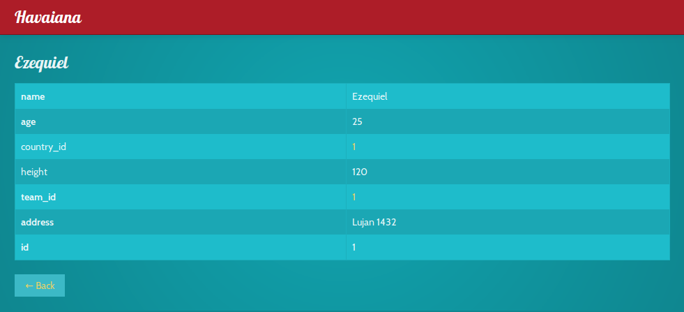
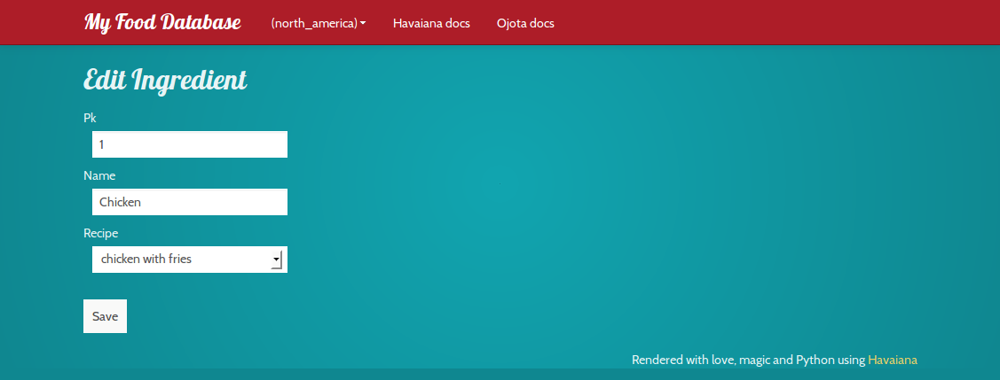
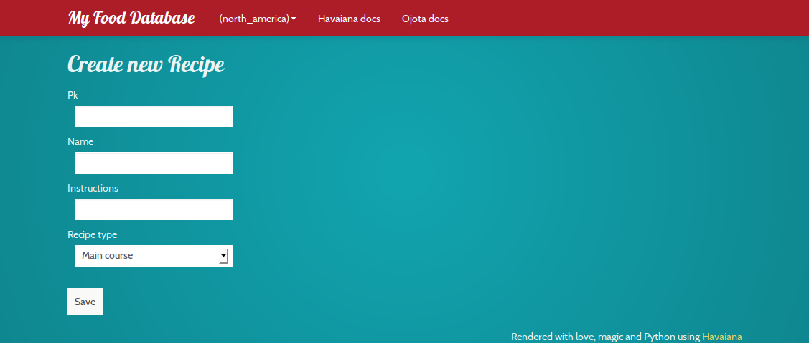

.. Havaiana documentation master file, created by
   sphinx-quickstart on Wed Jul 25 21:11:58 2012.
   You can adapt this file completely to your liking, but it should at least
   contain the root `toctree` directive.

Welcome to Havaiana's documentation!
=================================

Havaiana is a dynamic web interface for Ojota (http://ojota.rtfd.org).

Havaiana is Free Software! you can check the code at http://bitbucket.org/felipelerena/havaiana

How to use it
=======================
Hello World
___________

.. code-block:: python
   
   import ojota.examples.examples as pkg
   from havaiana import run

   run(pkg)

Custom rendering for a field
____________________________

.. code-block:: python
   
    import food_data

    from havaiana import run

    def ingredients_list(field, item, backwards):
        required = field in item.required_fields
        ingredients = getattr(item, field)
        items = []
        for element in ingredients:
            item = '<li><a href="/Ingredients/%s">%s</a></li>' % (element.primary_key,
                                                        element)
            items.append(item)
        value = "<ul>%s</ul>" %  "".join(items)
        related = False

        return (field, value, required, related)
    if __name__ == "__main__":
        renderers = [('Recipe', 'ingredients', ingredients_list)]
        run(food_data, "My Food Database", renderers)

        run(pkg)

Screenshots
===========

   *All the data sources in the package.*

.. figure:: screenshots/2.png
   :align: center
   :width: 800

   *The items in the data source.*

   *An item detail.*

   *Edit an existing element.*

   
   *Create new element.*

.. figure:: screenshots/6.png
   :align: center
   :width: 800

   *A view with custom rendering.*

Installation
============
With easy_install

.. code-block:: bash

    sudo easy_install Havaiana

With pip

.. code-block:: bash

    sudo pip install Havaiana

From source

.. code-block:: bash

    hg clone ssh://hg@bitbucket.org/felipelerena/Havaiana
    sudo python setup.py install

Table of contents
=================
.. toctree::
   :maxdepth: 2

    Read the module documentation <module>

Dependencies
=====================
 * flask
 * Ojota
 * wtforms

Indices and tables
==================

* :ref:`genindex`
* :ref:`modindex`
* :ref:`search`

